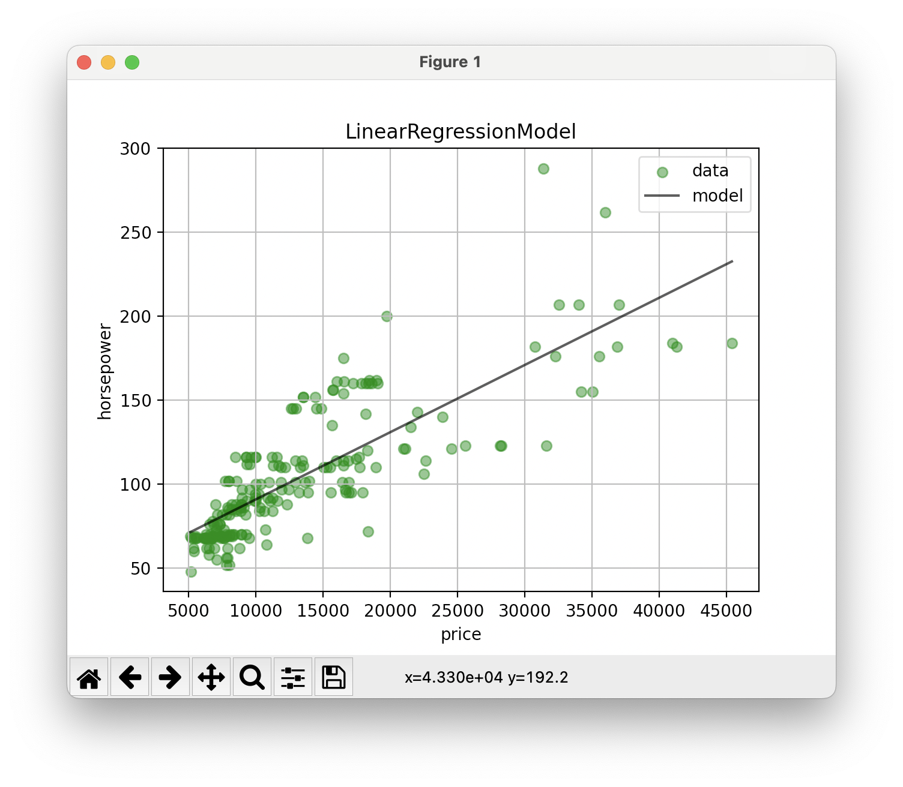

# FT_LINEAR_REGRESSION
The goal of this project is to implement a simple linear regression model

# Requirements
`python3`  
`pip3 install matplotlib pandas`

# Use
First, train your data  
`python3 srcs/train.py your_model.csv`

A file containing the result of the training is created.
You are now able to use the `predict.py` program to test the model !  
`python3 srcs/predict.py same_model.csv`

## Constraints
- You can only use a `.csv` file as your data
- This file cannot have more than 2 columns
- Each column must only contain numbers (apart from the headers which can contain whatever)
